# eVote360 Pro

Sistema de votación electrónica en ASP.NET Core MVC (.NET 9) con arquitectura Onion. Cubre el ciclo electoral completo: configuración por el administrador, gestión de candidatos y alianzas por los dirigentes políticos, y votación del ciudadano con validación de cédula por OCR y código de verificación por correo.

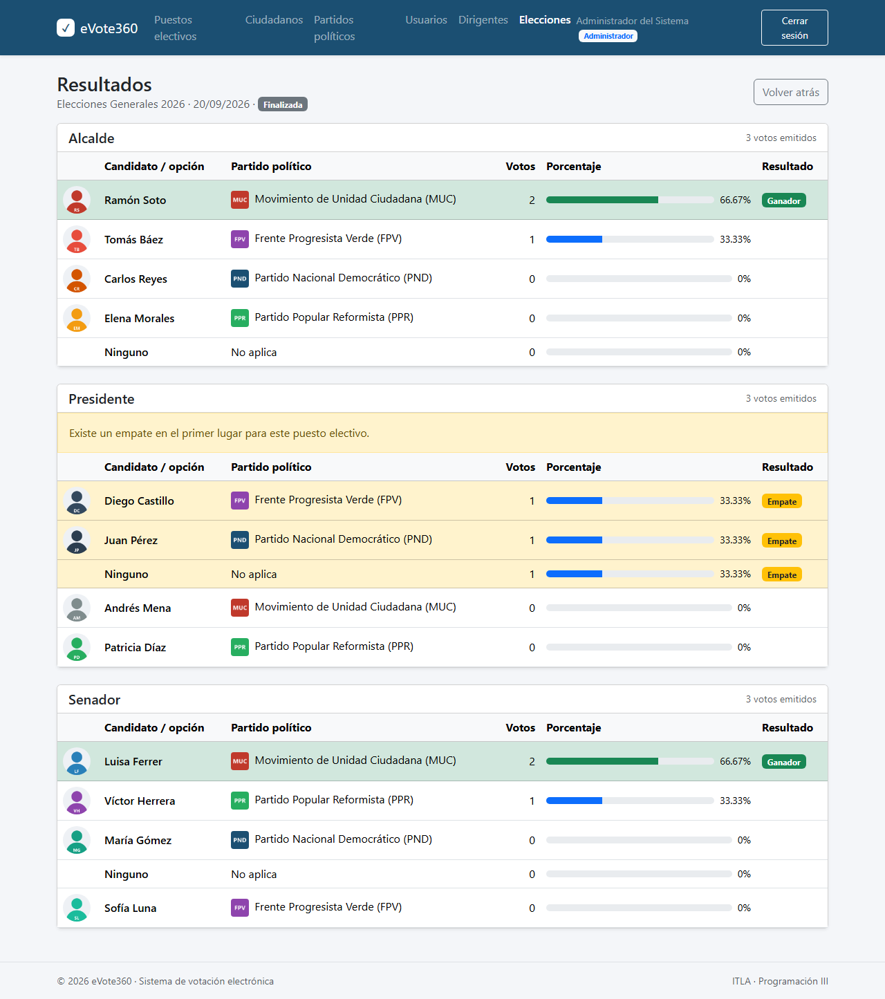

## Roles y funcionalidades

**Elector (sin iniciar sesión)**

1. Ingresa su número de documento. Se valida que exista una elección activa, que el ciudadano esté registrado, activo y que no haya votado.
2. Sube una foto de su cédula. Tesseract extrae el texto y el número debe coincidir con el ingresado.
3. Recibe un código de 6 dígitos por correo, con 5 minutos de vigencia y de un solo uso.
4. Vota puesto por puesto, con la opción "Ninguno" disponible, y puede modificar su selección hasta finalizar.
5. Al finalizar se registran los votos de forma anónima, se marca su participación y recibe un resumen por correo.

**Administrador**

- Mantenimientos de puestos electivos, ciudadanos, partidos políticos (con logo) y usuarios.
- Asignación uno a uno de dirigentes políticos a partidos.
- Elecciones: creación en estado pendiente, activación manual con validación completa de la configuración, finalización y resultados con porcentajes, ganador y detección de empates.
- Resumen electoral por año: partidos participantes, candidatos reales (sin duplicar aliados) y ciudadanos que votaron.

**Dirigente político**

- Home con datos del partido asignado e indicadores (candidatos activos e inactivos, alianzas vigentes, solicitudes pendientes, candidatos asignados).
- Candidatos del partido, con foto.
- Alianzas políticas: solicitar, aceptar, rechazar, eliminar solicitudes y alianzas vigentes.
- Asignación de candidatos propios o aliados a puestos electivos, aplicando las reglas de alianzas.

**Reglas transversales**

- Mientras exista una elección activa se bloquean todos los mantenimientos y acciones de configuración. Los botones se deshabilitan y se muestra el motivo.
- Los datos principales de puestos, partidos, candidatos y ciudadanos que ya participaron en una elección quedan bloqueados para no alterar resultados históricos.
- Toda eliminación es lógica (activar e inactivar), salvo las relaciones dirigente-partido y candidato-puesto.
- Control de acceso por rol con redirección a acceso denegado y al Home correspondiente.

## Capturas

| Pantalla del elector | Validación de cédula (OCR) |
|---|---|
| 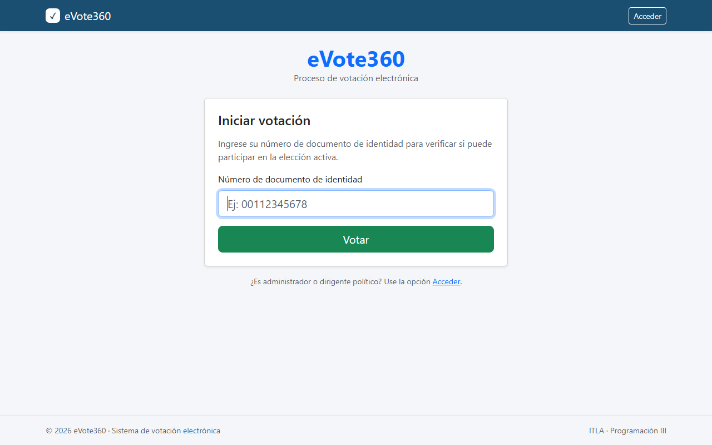 | 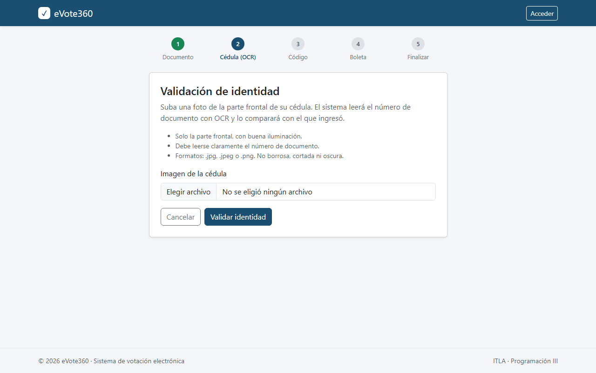 |

| Código de verificación | Boleta por puesto |
|---|---|
| 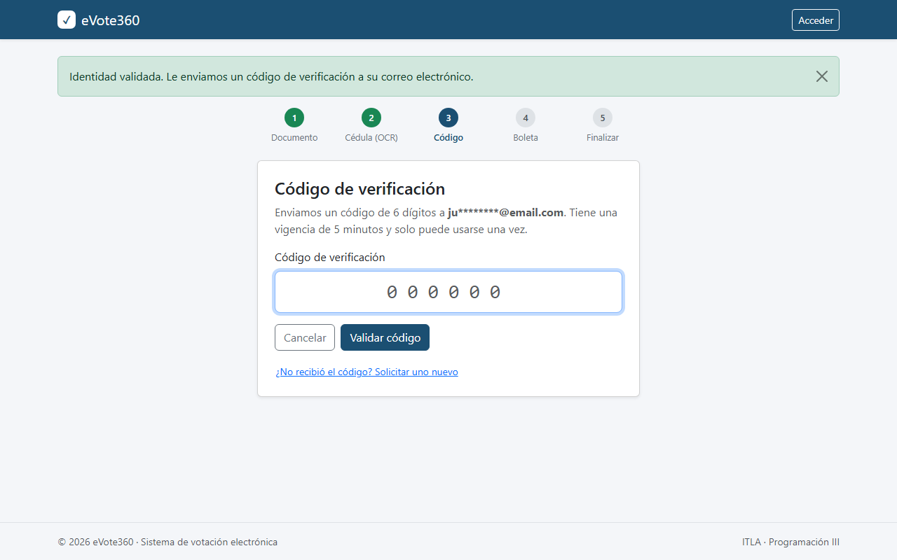 | 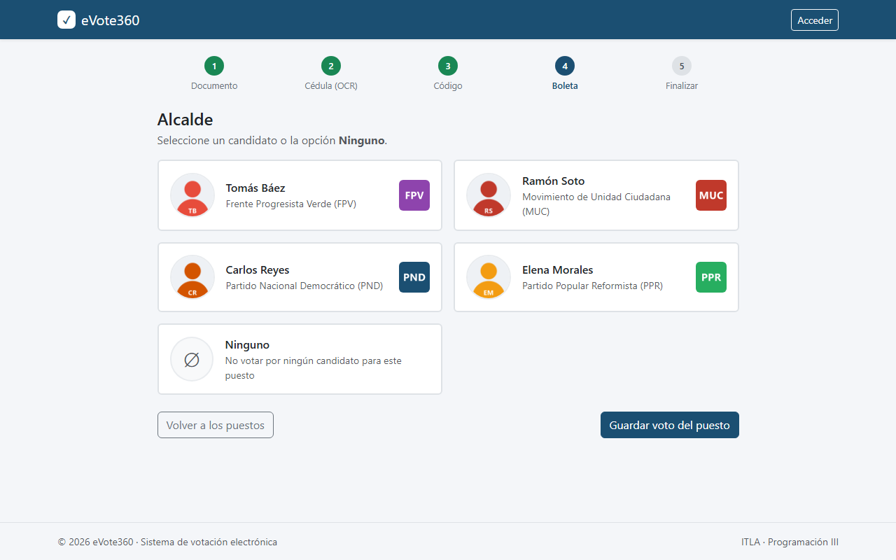 |

| Puestos electivos disponibles | Votación completada |
|---|---|
| 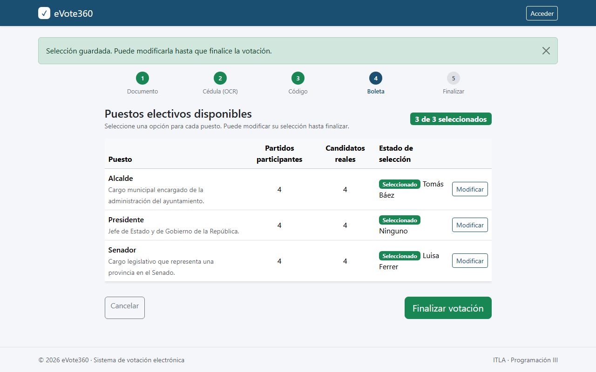 | 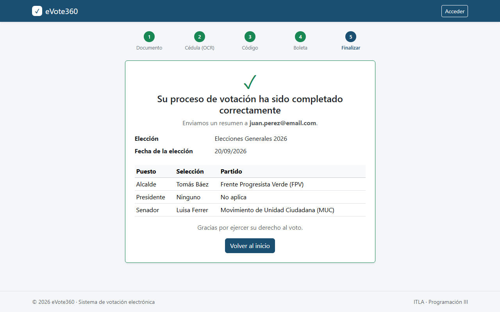 |

| Correo con el resumen | Validaciones del proceso |
|---|---|
| 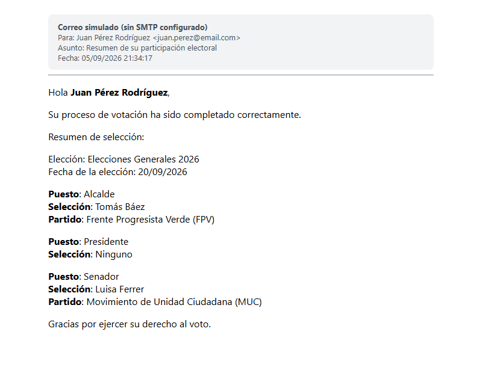 | 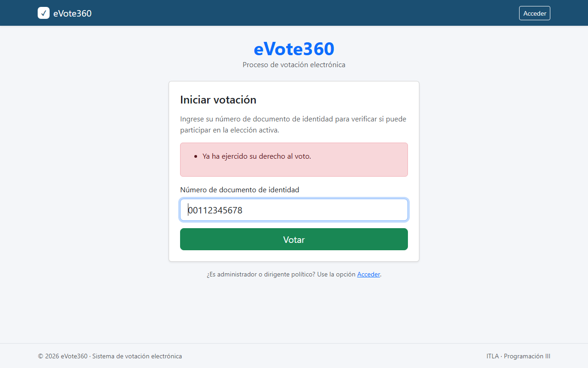 |

| Home del administrador | Elecciones |
|---|---|
| 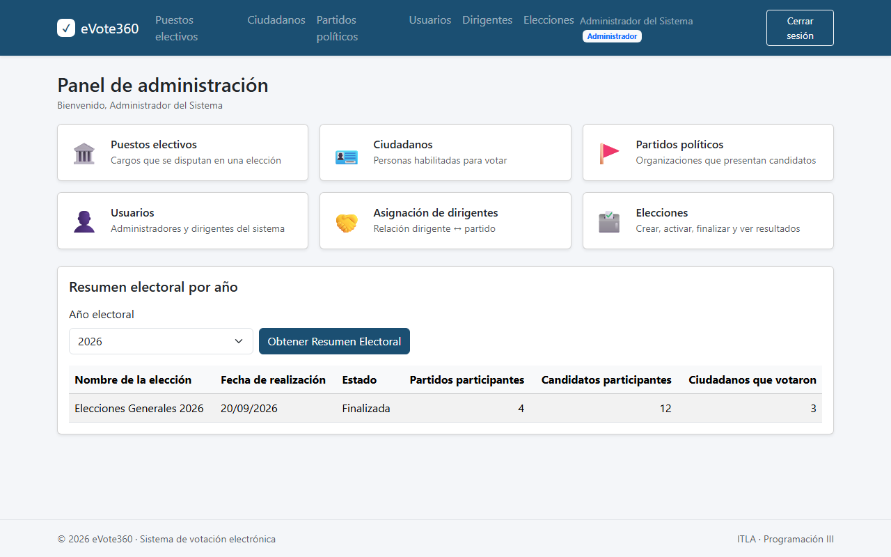 | 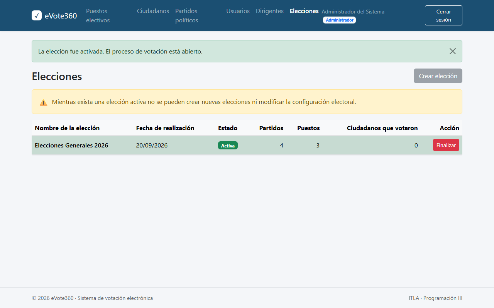 |

| Home del dirigente | Alianzas políticas |
|---|---|
| 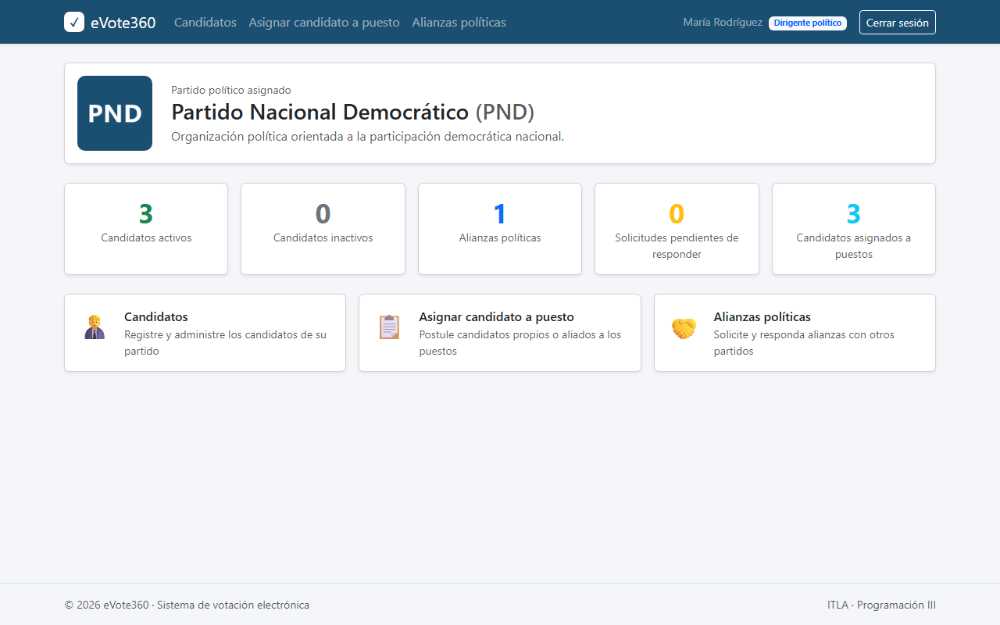 | 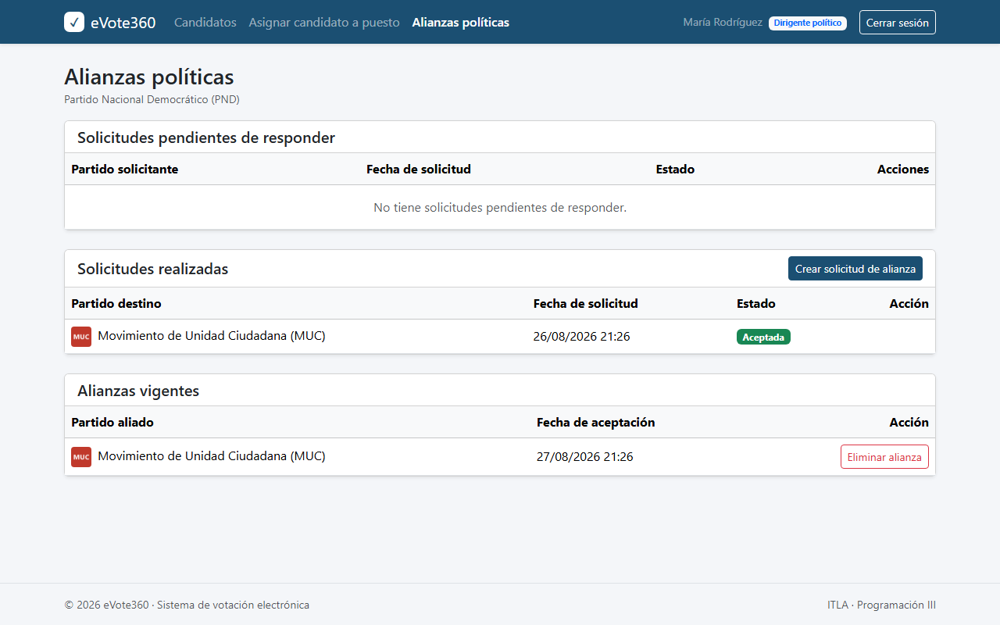 |

| Mantenimiento bloqueado por elección activa | Acceso denegado |
|---|---|
| 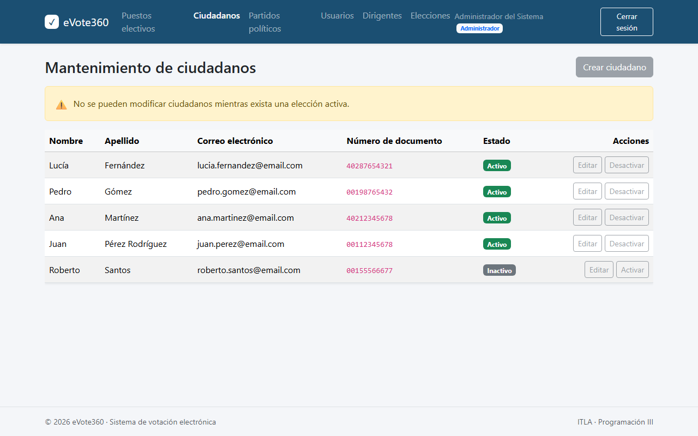 | 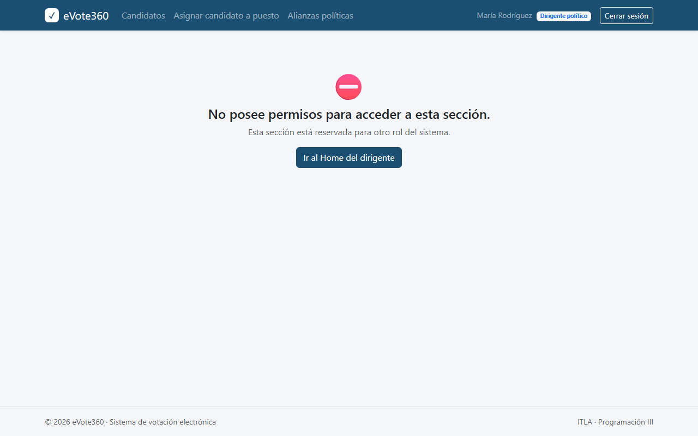 |

## Arquitectura

```
eVote360.sln
├── eVote360.Core            Entidades, enums, DTOs e interfaces (sin dependencias)
├── eVote360.Infrastructure  EF Core (SQL Server), repositorio genérico, servicios, OCR, migraciones
├── eVote360.Shared          Servicio de correo (MailKit) reutilizable
└── eVote360                 MVC: controladores, ViewModels, vistas, filtros
```

- **Onion:** las dependencias apuntan hacia `Core`. Los controladores solo hablan con interfaces de servicios; las reglas de negocio viven en `Infrastructure/Services`.
- **Repositorio genérico:** `IGenericRepository<T>` centraliza el acceso a datos; los servicios lo combinan con consultas específicas de EF Core.
- **ViewModels y DTOs:** los formularios validan con DataAnnotations en ViewModels; los servicios devuelven DTOs a las vistas.
- **Confidencialidad del voto:** la tabla `Votos` no guarda el ciudadano. La participación se registra aparte en `ParticipacionesEleccion`, lo que impide votar dos veces sin vincular a la persona con su selección.
- **Sin copias históricas:** al activar una elección solo se registran las relaciones candidato-partido-puesto en `CandidaturasEleccion`. Los resultados se calculan con los datos actuales y los campos críticos quedan bloqueados.
- **Correo:** con SMTP configurado envía por MailKit. Sin configurar, guarda cada correo como HTML en `eVote360/App_Data/correos`, lo que permite probar todo el flujo en desarrollo.

## Cómo ejecutarlo

Requisitos: SDK de .NET 9 y SQL Server (local o Express). El modelo de Tesseract ya está incluido en `eVote360/tessdata`.

```bash
git clone https://github.com/MarioMahir/eVote360-Pro.git
cd eVote360-Pro
dotnet run --project eVote360
```

Al arrancar, la aplicación aplica las migraciones pendientes y crea el administrador inicial si no existe:

| Usuario | Contraseña |
|---|---|
| `admin` | `Admin1234` |

La cadena de conexión está en `eVote360/appsettings.json` (`Server=localhost;Database=eVote360`). Para usar otra instancia sin modificar el archivo:

```powershell
$env:ConnectionStrings__DefaultConnection = "Server=localhost\SQLEXPRESS;Database=eVote360;Trusted_Connection=True;TrustServerCertificate=True;"
dotnet run --project eVote360
```

### Datos de demostración

Con `SeedDemoData=true` se cargan 3 puestos, 4 partidos con sus dirigentes, 12 candidatos ya asignados, una alianza vigente y 5 ciudadanos, listos para crear y activar una elección:

```powershell
$env:SeedDemoData = "true"
dotnet run --project eVote360
```

| Rol | Usuario | Contraseña |
|---|---|---|
| Dirigente PND | `mrodriguez` | `Dirigente1234` |
| Dirigente MUC | `cperez` | `Dirigente1234` |
| Dirigente PPR | `lgomez` | `Dirigente1234` |
| Dirigente FPV | `jmartinez` | `Dirigente1234` |

Para probar el flujo del elector use el documento `00112345678` y la imagen `docs/cedula-prueba.png` como cédula. El código de verificación queda en `eVote360/App_Data/correos`.

### Correo real (opcional)

Configure `EmailSettings` con user-secrets para no guardar credenciales en el repositorio. Con Gmail se necesita una contraseña de aplicación:

```bash
dotnet user-secrets set "EmailSettings:Host" "smtp.gmail.com" --project eVote360
dotnet user-secrets set "EmailSettings:Port" "587" --project eVote360
dotnet user-secrets set "EmailSettings:User" "tu-correo@gmail.com" --project eVote360
dotnet user-secrets set "EmailSettings:Password" "contraseña-de-aplicacion" --project eVote360
dotnet user-secrets set "EmailSettings:FromEmail" "tu-correo@gmail.com" --project eVote360
```

## Stack

ASP.NET Core 9 MVC, Entity Framework Core 9 (Code First, SQL Server), autenticación por cookies con roles, Bootstrap 5, Tesseract 5 (OCR), MailKit (SMTP).

## Equipo

Proyecto del módulo de Programación III (ITLA, 2026): Mario Sabala, Jorge Alejandro De Los Santos Senices y Dionis Emil Marzán Mejía.
